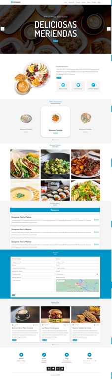

## Cucinare - Página web del Restaurante
¡Bienvenido a Cucinare, el restaurante donde encontrarás una variedad de deliciosas comidas para disfrutar en cualquier momento del día! Diseñada para brindarte información sobre nuestros menús, desayunos, meriendas y opciones de pedido a domicilio.

## Características
- Variedad de Comida: En Cucinare, ofrecemos una amplia selección de platos deliciosos y sabrosos. Desde opciones vegetarianas hasta platos de carne, mariscos y más, hay algo para todos los gustos.

- Desayunos y Meriendas: Además de nuestros almuerzos y cenas, también servimos desayunos y meriendas deliciosas. Comienza tu día con un desayuno energizante o disfruta de una merienda deliciosa en cualquier momento.

- Menús Especiales: Nuestros menús especiales están diseñados para ofrecerte una experiencia gastronómica completa. Ya sea una cena romántica, una comida familiar o una celebración especial, nuestros menús se adaptan a diferentes ocasiones.

- Pedido a Domicilio: Si prefieres disfrutar de nuestra comida en la comodidad de tu hogar, ofrecemos un servicio de entrega a domicilio. Simplemente llena nuestro formulario de pedido y te llevaremos tus platos favoritos directamente a tu puerta.

## Requisitos Previos
No se requieren requisitos previos para acceder a la página web de Cucinare. Puedes visitar nuestro sitio desde cualquier dispositivo con conexión a Internet.

## Uso
1. Abre tu navegador web preferido.
2. Visita la página web de Cucinare en la siguiente dirección: www.cucinare.com.
3. Explora nuestra página principal para conocer más sobre nuestra propuesta gastronómica y las opciones de menús.
4. Navega por las secciones de desayunos, meriendas y menús especiales para descubrir nuestras deliciosas opciones.
5. Si deseas solicitar un pedido a domicilio, haz clic en la sección "Pedido a Domicilio" y completa el formulario con tus datos y tu selección de platos.
6. Confirma tu pedido y espera la entrega en la dirección que proporcionaste.

## Autoría
Autor: Iara Barcos
Sitio web: https://github.com/Iara2002/